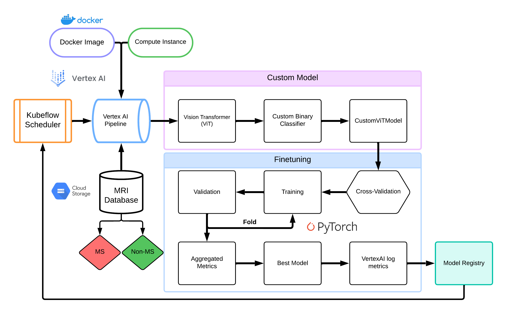

# Multiple sclerosis MRI Classification Pipeline

This pipeline automates the process of training and deploying a vision transformer model for classifying Multiple Sclerosis (MS) MRI scans. It utilizes Google Cloud Platform's Vertex AI for orchestration and scalability. The primary task of the model is to predict whether a patient has MS or not (NON-MS) based on their MRI scans. This binary classification helps in early detection and diagnosis of Multiple Sclerosis, potentially leading to more timely and effective treatment interventions.

## Pipeline Components

### 1. Data Preparation
Source: MRI scans stored in Google Cloud Storage (GCS)   
Classes: 'NON-MS' and 'MS'   
Processing: Custom dataset class for loading and balancing   

### 2. Model Architecture
Base Model: Pre-trained Vision Transformer (ViT) (vit-base-patch16-384)  
Customization: Added classifier for binary classification   
   
### 3. Training Process
Cross-Validation: 6-fold stratified   
Optimization: AdamW optimizer with linear learning rate schedule   
Loss Function: Binary Cross-Entropy   
Early Stopping: Based on validation loss   

### 4. Evaluation
Metrics: Accuracy, Precision, Recall, F1-Score   
Reporting: Per-fold and averaged across folds   

### 5. Model Saving
Format: PyTorch state dict   
Storage: GCS bucket with timestamp   

### 6. Vertex AI Integration  
Metric Logging: Training and validation metrics   
Model Registry: Automated model versioning   

## Pipeline Workflow
Data Loading: Fetch MRI scans from GCS   
Model Initialization: Set up custom ViT model   
### Cross-Validation Loop:   
Train on 5 folds   
Validate on 1 fold   
Log metrics to Vertex AI   
   
Model Evaluation: Aggregate results across all folds   
Model Saving: Store best model in GCS   
Model Registration: Upload to Vertex AI Model Registry   

## Scheduling
Frequency, Timing, and Concurrency settings    

## Outputs
Trained model artifact   
Performance metrics   
Registered model in Vertex AI   

## Usage
To deploy this pipeline:   
Ensure GCP credentials are set up   
Run the gcp_pipeline.py script to compile and submit the pipeline   
Monitor the pipeline job in Vertex AI console   

## Notes
Adjust hyperparameters in gcp_MS_f_2C.py for optimization   
Ensure sufficient GCS permissions for data access and model storage   
 
